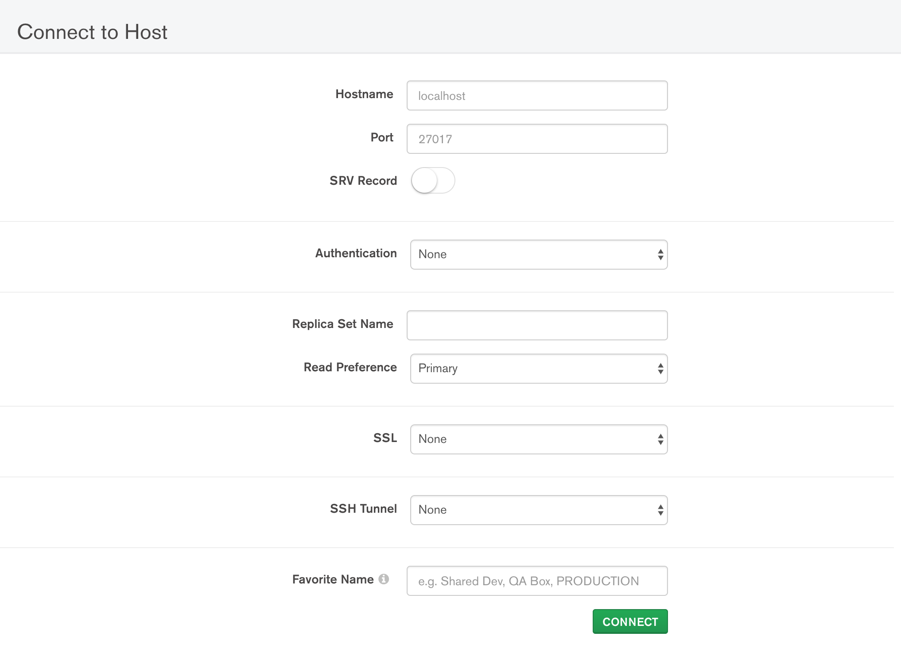
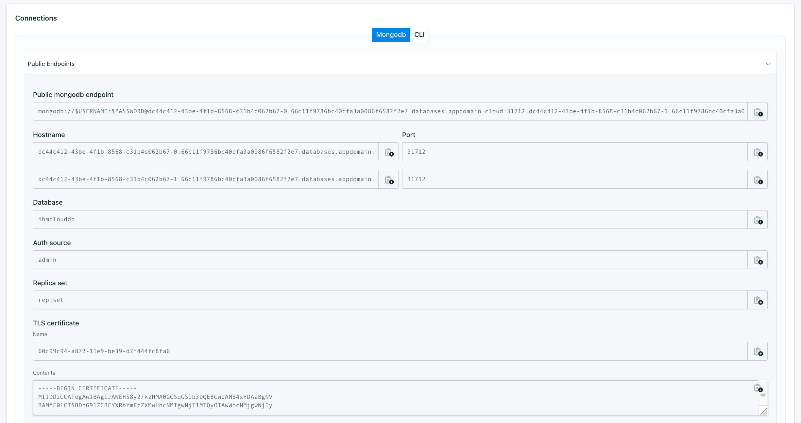
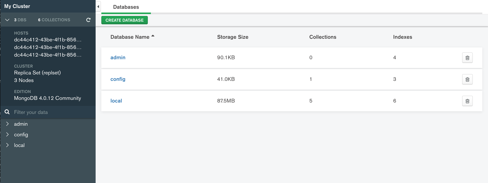

---
copyright:
  years: 2019
lastupdated: "2019-11-20"

keywords: mongodb, databases, mongodb compass

subcollection: databases-for-mongodb

---

{:shortdesc: .shortdesc}
{:new_window: target="_blank"}
{:codeblock: .codeblock}
{:pre: .pre}
{:screen: .screen}
{:tip: .tip}

# Getting Started Tutorial
{: #getting-started}

This tutorial is a short introduction to using an {{site.data.keyword.databases-for-mongodb_full}} deployment. MongoDB Compass is a GUI for MongoDB, provided by the developers for MongoDB. The Community Edition is the version that is bundled with MongoDB Community Server, and provides basic tools for viewing your MongoDB databases. You can download a stand-alone edition from MongoDB and connect it to your {{site.data.keyword.databases-for-mongodb}} deployment.

## Before you begin

- You need to have an [{{site.data.keyword.cloud_notm}} account](https://cloud.ibm.com/registration){:new_window}.
- And a {{site.data.keyword.databases-for-mongodb}} deployment. You can provision one from the [{{site.data.keyword.cloud_notm}} catalog](https://cloud.ibm.com/catalog/databases-for-mongodb). Give your deployment a memorable name that appears in your account's Resource List.
- [Set the Admin Password](/docs/databases-for-mongodb?topic=databases-for-mongodb-admin-password) for your deployment.
- [MongoDB Compass Community Edition](https://www.mongodb.com/download-center/compass) from MongoDB.

## Connecting with MongoDB Compass

When you first open MongoDB Compass, you get a **Connect to Host** page. This page is where you enter the connection information for your deployment. 

On your deployment's _Manage_ page, there is a panel with all the relevant connection information.

To fill out the MongoDB Compass page,

- For _Hostname_, you can use either of the two hostnames for your deployment.
- In the _Authentication_ field, select `Username/Password`, and enter the credentials that you set for the admin user in the prerequisites. The _Authentication Database_ should stay at the default of 'admin'.
- Enter the _Replica Set_ name of your deployment (it is probably `replset`) into the _Replica Set Name_ field on MongoDB Compass.
- Configure the _SSL_ settings.
    1. Copy the certificate information from the _Connections_ panel.
    2. Save the certificate  to a file. (You can use the Name that is provided or your own file name).
    3. Set the **SSL** field in MongoDB Compass to _Server Validation_.
    4. Click **Select Files** in the _Certificate Authority_ field and upload the certificate file to MongoDB Compass.
- If you want to, you can give your {{site.data.keyword.databases-for-mongodb}} deployment a name.

Click the **Connect** button to connect MongoDB Compass to your {{site.data.keyword.databases-for-mongodb}} deployment.

## Using MongoDB Compass

Once you have connected to your deployment, you see a basic overview. Included is a simple summary of the cluster and the default databases. The cluster contains three nodes, the two data nodes and the third arbiter node, so it shows the three hosts and their replica set. Also shown is the current MongoDB version, {{site.data.keyword.databases-for-mongodb}} uses the Community version of the MongoDB database.

Next, you see the default databases for your deployment, which all hold information related to the database instance. `local` holds replication data. `config` holds data for cluster operations. `admin` holds user authentication data. MongoDB Compass might not have access to all the data in these databases for permissions and security reasons.

Now you can use MongoDB Compass to view any data you and your applications have stored in your deployment. You can also use MongoDB Compass to create new databases, collections, and documents. Specific information can be found in the [MongoDB Compass documentation](https://docs.mongodb.com/compass/current/).

## Next Steps

If you are just using MongoDB for the first time, it is a good idea to take a tour through the [official MongoDB documentation](https://docs.mongodb.com/). 

You can connect to and manage your MongoDB through the [Mongo shell](/docs/databases-for-mongodb?topic=databases-for-mongodb-mongo-shell).

Looking for more tools on managing your databases and data? You can connect to your deployment with [IBM Cloud CLI](/docs/cli/reference/ibmcloud?topic=cloud-cli-install-ibmcloud-cli) and the [Cloud Databases CLI plug-in](/docs/databases-cli-plugin?topic=databases-cli-plugin-cdb-reference). Or use the [Cloud Databases API](https://cloud.ibm.com/apidocs/cloud-databases-api).

If you are planning to use {{site.data.keyword.databases-for-mongodb}} for your applications, check out some of our other documentation pages.
- [Connecting an external application](/docs/databases-for-mongodb?topic=databases-for-mongodb-external-app)
- [Connecting an IBM Cloud application](/docs/databases-for-mongodb?topic=databases-for-mongodb-ibmcloud-app)

Also, to ensure the stability of your applications and your database, check out the pages on 
- [High-Availability](/docs/databases-for-mongodb?topic=databases-for-mongodb-high-availability)
- [Performance](/docs/databases-for-mongodb?topic=databases-for-mongodb-performance)

