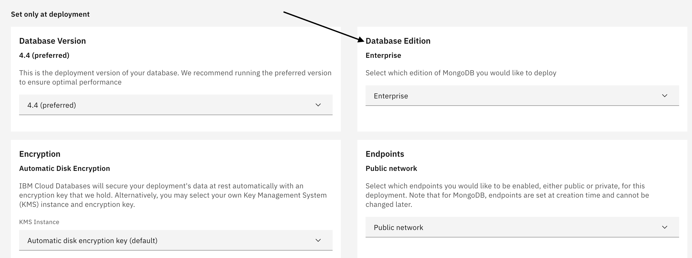

---
copyright:
  years: 2019, 2022
lastupdated: "2022-08-23"

keywords: mongodb, databases, mongodb compass, mongodbee, mongodb enterprise, mongodb ee provision, mongodb compass, mongodb ops manager

subcollection: databases-for-mongodb

---

{:shortdesc: .shortdesc}
{:external: .external target="_blank"}
{:codeblock: .codeblock}
{:pre: .pre}
{:screen: .screen}
{:tip: .tip}
{:important: .important}

# Getting Started
{: #getting-started}

{{site.data.keyword.databases-for-mongodb_full}} allows developers to take advantage of the latest MongoDB features: rich JSON documents, powerful query language, multi-document transactions, and authentic APIs. The service also automates common database administration tasks like high availability, backups, encryption, and infrastructure planning.

To get started with {{site.data.keyword.databases-for-mongodb_full}}, you need to take advantage of MongoDB Compass, an interactive GUI tool for querying, optimizing, and analyzing your MongoDB data. The full-featured [Compass Edition](https://docs.mongodb.com/compass/master/#available-compass-short-editions){: .external} provides basic tools for viewing your MongoDB databases. 

## Before you begin
{: #before-begin-mongodb}

- You need to have an [{{site.data.keyword.cloud_notm}} account](https://cloud.ibm.com/registration){: external}.
- You also need a {{site.data.keyword.databases-for-mongodb}} deployment. You can provision one from the [{{site.data.keyword.cloud_notm}} catalog](https://cloud.ibm.com/catalog/databases-for-mongodb). Give your deployment a memorable name that appears in your account's Resource List.
- [Set the Admin Password](/docs/databases-for-mongodb?topic=databases-for-mongodb-admin-password) for your deployment.
- Download and install [MongoDB Compass](https://docs.mongodb.com/compass/master/install/){: .external} from MongoDB.
- If your deployment is not using public endpoints, take [these additional steps](https://cloud.ibm.com/docs/databases-for-mongodb?topic=cloud-databases-service-endpoints#private-endpoint-connections) to configure private endpoint access. 
  
    MongoDB cannot support both [public and private endpoints simultaneously](https://cloud.ibm.com/docs/databases-for-mongodb?topic=cloud-databases-service-endpoints#provisioning-with-service-endpoints). This cannot be changed after provisioning.
    {: .important}

Review the [`Getting to production`](/docs/cloud-databases?topic=cloud-databases-best-practices) documentation for general guidance on setting up a basic {{site.data.keyword.databases-for-mongodb_full}} deployment.

## {{site.data.keyword.databases-for-mongodb_full}} Enterprise Edition
{: #mongodbee}

{{site.data.keyword.databases-for-mongodb_full}} Enterprise Edition (EE) offers more functionality, including:
* Automatic, client-side encryption
* [Audit logging](/docs/databases-for-mongodb?topic=databases-for-mongodb-auditlogging)
* Federal Information Processing Standard (FIPS) approved encryption
* [Ops Manager](/docs/databases-for-mongodb?topic=databases-for-mongodb-ops-manager), which allows you to manage, monitor, and back up MongoDB deployments
* [MongoDB EE Analytics Add-On](/docs/databases-for-mongodb?topic=databases-for-mongodb-mongodbee-analytics), which allows you to make your query data compatible with business intelligence (BI) tools

### Provisioning {{site.data.keyword.databases-for-mongodb_full}} EE
{: #mongodbee-provision}

To take advantage of the additional functionality of {{site.data.keyword.databases-for-mongodb_full}} EE, choose **Enterprise** during your {{site.data.keyword.databases-for-mongodb_full}} provisioning process.

{: caption="Figure 1. MongoDB Enterprise Edition Provisioning" caption-side="bottom"}

## Connecting with MongoDB Compass
{: #connecting-mongodb-compass}

When you first open MongoDB Compass to the **Connect to Host** page, enter your deployment's connection information. All relevant connection information can be found within your deployment's _Manage_ page.

{: caption="Figure 2. Endpoints panel" caption-side="bottom"}

To complete the MongoDB Compass page,

- For _Hostname_, use either of the two hostnames for your deployment.
- In the _Authentication_ field, select `Username/Password`, and enter the credentials that you set for the admin user in the prerequisites. The _Authentication Database_ should stay at the default of 'admin'.
- Enter the _Replica Set_ name of your deployment (it is probably `replset`) into the _Replica Set Name_ field on MongoDB Compass.
- Configure the _SSL_ settings.
    1. Copy the certificate information from the _Endpoints_ panel.
    2. Save the certificate to a file. (You can use the name that is provided in the download, or your own file name.)
    3. Set the **SSL** field in MongoDB Compass to _Server Validation_.
    4. Click **Select Files** in the _Certificate Authority_ field and upload the certificate file to MongoDB Compass.
- If you want to, you can give your {{site.data.keyword.databases-for-mongodb}} deployment a name.

{: caption="Figure 3. Completed Connect to Host page" caption-side="bottom"}

Click **Connect** to connect MongoDB Compass to your {{site.data.keyword.databases-for-mongodb}} deployment.

## Using MongoDB Compass
{: #using-mongodb-compass}

Once you have connected to your deployment, you see a basic overview. Included is a simple summary of the cluster and the default databases. The cluster contains three nodes, the two data nodes and the third arbiter node, so it shows the three hosts and their replica set. Also shown is the current MongoDB version. {{site.data.keyword.databases-for-mongodb}} Standard uses the Community version while {{site.data.keyword.databases-for-mongodb}} EE uses the Enterprise version of the MongoDB database.

{: caption="Figure 3. MongoDB Compass page" caption-side="bottom"}

Next, you see the default databases for your deployment, which all hold information related to the database instance. `local` holds replication data. `config` holds data for cluster operations. `admin` holds user authentication data. MongoDB Compass might not have access to all the data in these databases for permissions and security reasons.

Now you can use MongoDB Compass to view any data you and your applications have stored in your deployment. You can also use MongoDB Compass to create new databases, collections, and documents. Specific information can be found in the [MongoDB Compass documentation](https://docs.mongodb.com/compass/current/){: .external}.

## Next Steps
{: #getting-started-mongodb-next-steps}

If you are using MongoDB for the first time, see the [official MongoDB documentation](https://docs.mongodb.com/){: .external}.

Connect to and manage your MongoDB database through the [Mongo shell](/docs/databases-for-mongodb?topic=databases-for-mongodb-mongo-shell).

Explore the [OpsManager](/docs/databases-for-mongodb?topic=databases-for-mongodb-ops-manager) functionality offered in {{site.data.keyword.databases-for-mongodb}} Enterprise Edition deployments.

Looking for more tools on managing your databases and data? Connect to your deployment with the [IBM Cloud CLI](/docs/cli?topic=cli-install-ibmcloud-cli) and the [Cloud Databases CLI plug-in](/docs/databases-cli-plugin?topic=databases-cli-plugin-cdb-reference). You can also use the [Cloud Databases API](https://cloud.ibm.com/apidocs/cloud-databases-api).

If you plan to use {{site.data.keyword.databases-for-mongodb}} for your applications, check out some of our other documentation pages.

- [Connecting an external application](/docs/databases-for-mongodb?topic=databases-for-mongodb-external-app)
- [Connecting an IBM Cloud application](/docs/databases-for-mongodb?topic=databases-for-mongodb-ibmcloud-app)
- [Connecting with the mongo Shell](/docs/databases-for-mongodb?topic=databases-for-mongodb-mongo-shell)
- [MongoDB Node.js Driver — Connection Guide](https://docs.mongodb.com/drivers/node/current/fundamentals/connection/)

For information on TLS/SSL certificate configuration in the API, review the documentation at.

- [Driver TLS and self-signed certificate support](/docs/databases-for-mongodb?topic=databases-for-mongodb-mongodb-external-app#mongodb-tls-certificate-support)
- [Using the self-signed certificate in mongo Shell](/docs/databases-for-mongodb?topic=databases-for-mongodb-mongo-shell#using-the-self-signed-certificate)
- [MongoDB TLS/SSL Configuration for Clients](https://docs.mongodb.com/manual/tutorial/configure-ssl-clients/){: .external}
  
Also, to ensure the stability of your applications and your database, check out the pages on.

- [High-Availability](/docs/databases-for-mongodb?topic=databases-for-mongodb-high-availability)
- [Performance](/docs/databases-for-mongodb?topic=databases-for-mongodb-performance)
