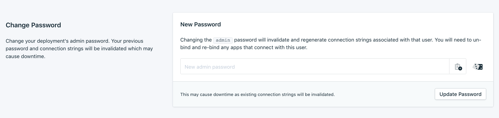

---
copyright:
  years: 2017, 2023
lastupdated: "2023-09-29"

keywords: mongodb, databases

subcollection: databases-for-mongodb

---

{{site.data.keyword.attribute-definition-list}}

# Setting the admin password
{: #admin-password}

## Setting the admin password through the UI
{: #admin-password-ui}
{: ui}

The {{site.data.keyword.databases-for-mongodb_full}} service is provisioned with an admin user.

Set the admin password before you use it to connect. To set the password through the {{site.data.keyword.cloud_notm}} dashboard, select _Manage_ from the service dashboard to manage your service. Open the _Settings_ tab, and use _Change Database Admin Password_ to set a new admin password.

{: caption="Figure 1. The Change Database Admin Password Panel in Settings" caption-side="bottom"}

## Setting the admin password through the CLI
{: #admin-password-cli}
{: cli}

Use the `cdb user-password` command from the {{site.data.keyword.cloud_notm}} CLI {{site.data.keyword.databases-for}} plug-in to set the admin password through the CLI.

For example, to set the admin password for your deployment, use the following command:
```sh
ibmcloud cdb user-password <INSTANCE_NAME_OR_CRN> admin <NEWPASSWORD>
```
{: pre}

## Setting the admin password through the API
{: #admin-password-api}
{: api}

The _Foundation Endpoint_ that is shown in the _Overview_ section of your service provides the base URL to access this deployment through the API. Use it with the `/deployments/{id}/users/{username}` endpoint to set the admin password.
```sh
curl -X PATCH `https://api.{region}.databases.cloud.ibm.com/v4/ibm/deployments/{id}/users/admin' \
-H "Authorization: Bearer $APIKEY" \
-H "Content-Type: application/json" \
-d '{"password":"newrootpasswordsupersecure21"}'
```

For more information, see the [API Reference](https://{DomainName}/apidocs/cloud-databases-api#set-database-level-user-s-password).
