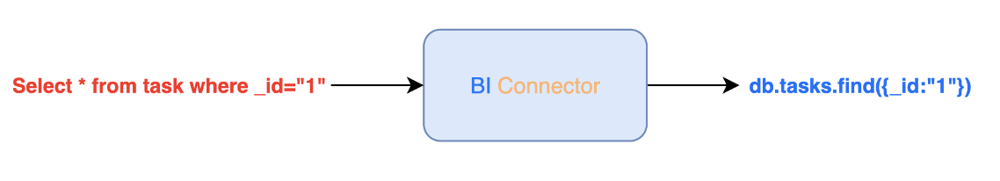
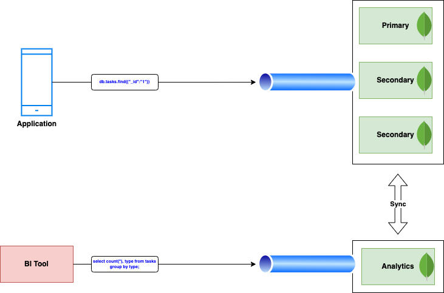

---
copyright:
  years: 2020, 2022
lastupdated: "2022-04-04"

keywords: databases, opsman, mongodbee, Enterprise Edition, analytics, bi connector

subcollection: databases-for-mongodb

---

{:external: .external target="_blank"}
{:shortdesc: .shortdesc}
{:screen: .screen}
{:codeblock: .codeblock}
{:pre: .pre}
{:tip: .tip}
{:note: .note}
{:important: .important}

# MongoDB Enterprise Edition Analytics Add-On
{: #mongodbee-analytics}

The {{site.data.keyword.databases-for-mongodb}} EE Analytics Add-On allows you to execute long-running analytical queries and/or provision a [MongoDB Connector for business intelligence(BI)](https://docs.mongodb.com/bi-connector/current/) to make your query data compatible with BI tools, such as [Tableau](https://www.tableau.com/).

The {{site.data.keyword.databases-for-mongodb}} EE (Enterprise Edition) Analytics Add-On is made up of two components:
- [The Analytics node](#mongodbee-analytics-node)
- [The connector for Business Intelligence (BI)](#mongodbee-analytics-connector-bi)

## What problems does the {{site.data.keyword.databases-for-mongodb}} Enterprise Edition Analytics Add-On solve?
{: #mongodbee-analytics-how-problem}

1. Most BI tools do not work with the MongoDB document data model. 

    MongoDB's document data model is made up of complex documents with arbitrary, nested data. This schema makes storing data flexible, easy, and scalable. However, most BI tools require data to be in tabular format, which is rigidly defined and stored in tables, not documents. The {{site.data.keyword.databases-for-mongodb}} Enterprise Edition Analytics Add-On converts MongoDB document data into SQL-readable tabular data:

    {: caption="Figure 1. Connector for BI converting document model to table" caption-side="bottom"}

1. BI queries are expensive and can degrade database performance. 
    Long-running queries can negatively impact the operational workflow of your deployment. The {{site.data.keyword.databases-for-mongodb}} Enterprise Edition Analytics Add-On introduces an extra data member, which isolates analytics from operation.

    {: caption="Figure 2. Introducing an extra data member" caption-side="bottom"}
    

## The {{site.data.keyword.databases-for-mongodb}} Enterprise Edition Analytics Add-On Components
{: #mongodbee-analytics-components}

The {{site.data.keyword.databases-for-mongodb}} Enterprise Edition Analytics Add-On consists of two components:
- the Analytics node
- connector for BI

### The Analytics node
{: #mongodbee-analytics-node}

<<<<<<< HEAD
The Analytics node isolates analytics from operational workload, allowing for long-running queries that do not impact operational workflow performance. You can use the Analytics node directly using MongoDB queries or by using SQL queries, if SQL queries are enabled by the connector for BI. 
=======
The Analytics node isolates analytics from operational workload, allowing for long-running queries that do not impact operational workflow performance. You can use the Analytics node directly using MongoDB queries or SQL queries, if SQL queries are enabled by the connector for BI. 
>>>>>>> draft

Enabling the Analytics node without engaging the connector for BI allows you to run document-type MongoDB queries or test a query on production data _without_ affecting your application. 
{: .note}

You can access your Analytics node directly through a connection string:

```shell
<connection string>
```

### The connector for BI
{: #mongodbee-analytics-connector-bi}

Traditional BI tools are designed to work with tabular, row-and-column data. The {{site.data.keyword.databases-for-mongodb}} Enterprise Edition Analytics Add-On connector for BI allows you to query MongoDB data with SQL using tools, such as Tableau, by connecting to the Analytics node and providing an SQL interface.

The {{site.data.keyword.databases-for-mongodb}} Enterprise Edition Analytics Add-On connector for BI cannot be enabled without the Analytics node.
{: .important}

## MongoDB Enterprise Edition Analytics Add-On Considerations
{: #mongodbee-analytics-consider}

Before taking advantage of the {{site.data.keyword.databases-for-mongodb}} Enterprise Edition Analytics Add-On, consider the following:

- The add-on is available only for {{site.data.keyword.databases-for-mongodb}} Enterprise Edition.
- You cannot deprovision the analytics node once it is enabled.
- You cannot scale the disk space of the Analytics member. 
  
    Scaling the disk space of the main database members will result in proportional scaling of the Analytics member.
    {: .important}

## Provisioning an Analytics node
{: #mongodbee-analytics-node-provisioning}

## Provisioning an Analytics node using terraform
{: #mongodbee-analytics-node-provisioning-terraform}


## Provisioning an Analytics node through the {{site.data.keyword.cloud_notm}} Databases API
{: #mongodbee-analytics-node-provisioning-api}


## Provisioning an Analytics node through the UI
{: #mongodbee-analytics-node-provisioning-ui}


## Enabling n {{site.data.keyword.databases-for-mongodb}} Enterprise Edition Analytics Add-On connector for BI
{: #mongodbee-analytics-bi-connector-enable}


