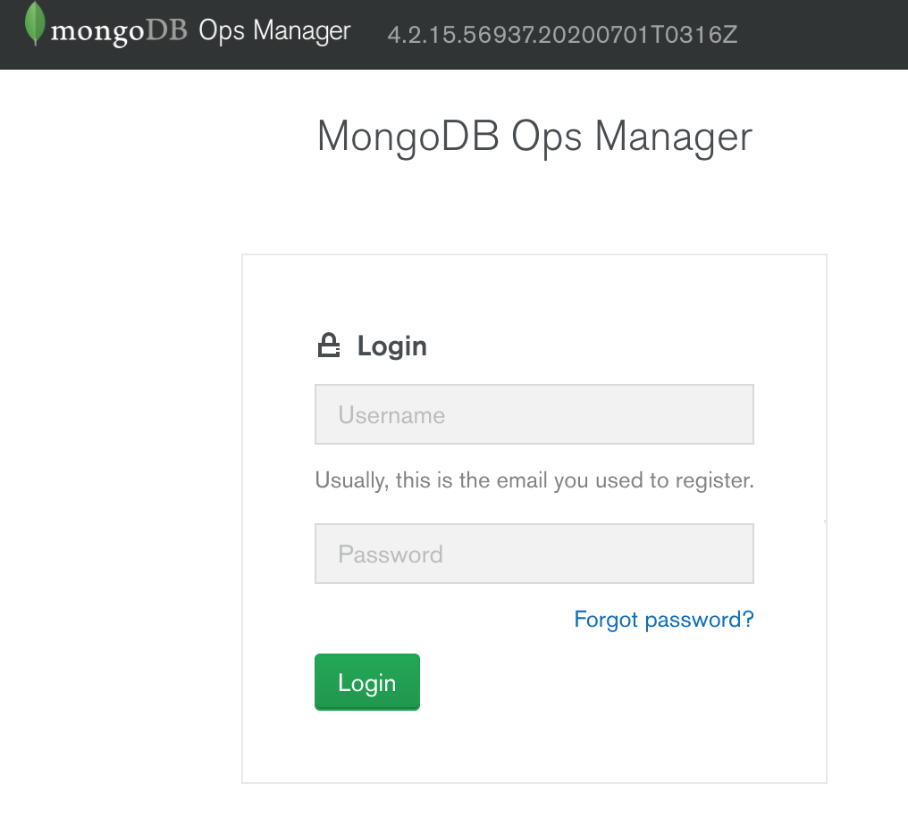
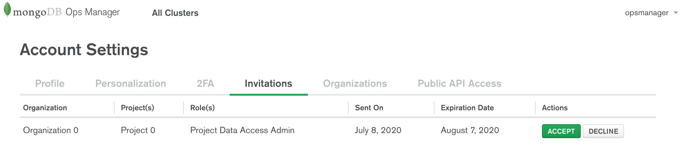
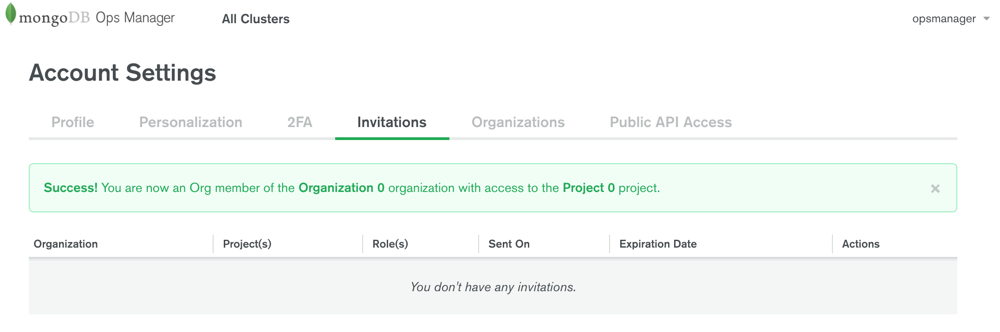
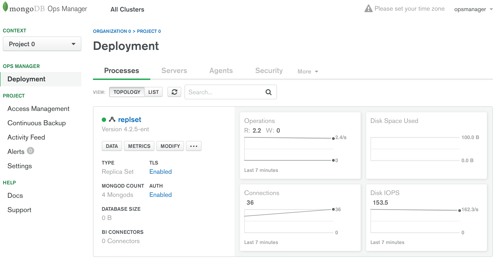
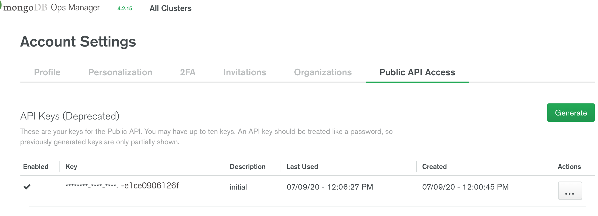
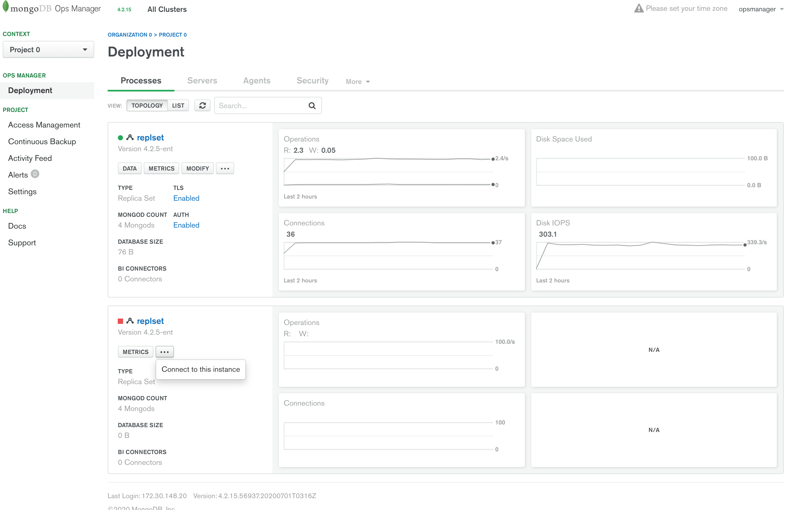

---
copyright:
  years: 2020
lastupdated: "2021-08-18"

keywords: databases, opsman, mongodbee, Enterprise Edition

subcollection: databases-for-mongodb

---

{:new_window: target="_blank"}
{:shortdesc: .shortdesc}
{:screen: .screen}
{:codeblock: .codeblock}
{:pre: .pre}
{:tip: .tip}
{:note: .note}

# MongoDB Enterprise Ops Manager
{: #ops-manager}
The Ops Manager is only available with an {{site.data.keyword.databases-for-mongodb_full}} Enterprise Edition deployment.

## Before you begin with the MongoDB Enterprise Ops Manager

- You need to have an [{{site.data.keyword.cloud_notm}} account](https://cloud.ibm.com/registration){:new_window}.
- And a {{site.data.keyword.databases-for-mongodb}} Enterprise Edition deployment. You can provision one from the [{{site.data.keyword.cloud_notm}} catalog](https://cloud.ibm.com/catalog/databases-for-mongodb). Give your deployment a memorable name that appears in your account's Resource List.
- [Set the Admin Password](/docs/databases-for-mongodb?topic=databases-for-mongodb-admin-password) for your deployment.
- Create an Ops Manager username and password.
 

## Creating an Ops Manager user
{: #create-ops-man}
Before logging in to the {{site.data.keyword.databases-for-mongodb}} Enterprise Edition Ops Manager, you must create an Ops Manager username and password for your deployment by using the [Cloud Databases API](https://cloud.ibm.com/apidocs/cloud-databases-api). To create a new Ops Manager user, run the following command: 

`ibmcloud cdb user-create <crn> <username> <password> -t ops_manager`

Note, the password must be at least 10 characters and contain at least one special character.

Example command: 
 ```
 ibmcloud cdb user-create "crn:v1:bluemix:public:databases-for-mongodb:us-south:a/40ddc34a953a8c02f10987b59085b60e:32bd88c9-1d96-4486-8012-1dgcd629e609::" newuser01 SuperSecure001! -t ops_manager
 ```
 {: .pre}

The Ops Manager user has limited permissions.
{: .note}


## Initial login
{: #initial-login}

The {{site.data.keyword.databases-for-mongodb}} Enterprise Edition service is provisioned with access to the MongodDB Ops Manager user interface.

As {{site.data.keyword.databases-for-mongodb}} Enterprise Edition uses self-signed certificates, your browser may require you to accept the certificate or add the certificate to your certificate store before being able to log in.
{: .tip}

After you create an Ops Manager username and password by using the [Cloud Databases API](https://cloud.ibm.com/apidocs/cloud-databases-api), you must follow these instructions to get access to the {{site.data.keyword.databases-for-mongodb}} Enterprise Edition instance within the Ops Manager UI:

1. Discover the Ops Manager link with the command:
    ```
    ibmcloud cdb deployment-connections <CRN> -t ops_manager
    ```
    {: .pre}
    
If setting up Ops Manager with private endpoints, you will need to append `-e 'private'` to your command.
{: .note}

2. Log in with the Ops Manager username and password you created for your deployment:
   
    

3. In the resulting view, select the 'Invitations' tab:
  
    

4. Click 'Accept' for the invitation as role 'Project Data Access Admin'. This step adds your Ops Manager user ID to the Organization and project shown:
  
    

5. Lastly, to navigate to the instance view: 
   - Click the 'Ops Manager' logo in the menu bar, 
   - Or select the 'All Clusters' link:
    
    

On subsequent logins you arrive at the last view, so the prior procedure is only necessary on the first login.
{: .tip}

If a user is removed from the Ops Manager, there is no method to manually resend an invitation. To add a user back to the Ops Manager interface, you need to delete the user with command `opsmanager_delete_user` first then create the same user again. The invitation is again available in the `Invitations` section as noted in the prior `Initial login` steps. 

## Connecting through private endpoints
{: #private-endpoints}

{{site.data.keyword.databases-for-mongodb}} Enterprise Edition offers an HTTPS accessible endpoint for the Ops Manager user interface. 

{{site.data.keyword.databases-for-mongodb}} Enterprise Edition also offers both private and public cloud service endpoints. If you want to access the Management UI from a browser that is not on the private network, you must take these additional steps as listed in the [Connecting Through Private Endpoints](/docs/databases-for-mongodb?topic=cloud-databases-service-endpoints#private-endpoints) documentation for {{site.data.keyword.cloud}} Databases.

After you configure your environment for private endpoint access, you can go to to the {{site.data.keyword.databases-for-mongodb}} Enterprise management endpoint URL from your browser. For example, `https://bfdb-4263-8ad2-c9a4beaf4591.8f7bfc8f3faa4218afd56e0.databases.appdomain.cloud:323232`


## Ops Manager API key creation and usage

{{site.data.keyword.databases-for-mongodb}} Enterprise Edition provides access to the Ops Manager API through generation of API keys. To do this: 
* Navigate to your `Account` page 
* From the `Public API Access` tab, you are able to generate up to ten API keys by using the `Generate` button. 


These are the 'deprecated' personal API-keys.
{: .note}

Using the Ops Manager connection string (also found in the [Getting connection strings](/docs/databases-for-mongodb?topic=databases-for-mongodb-connection-strings) section of your deployment dashboard), you can use the credentials that you created for Ops Manager user access to API commands. 

### Example connection details: 
 
You can use the example credentials as follow to query the Ops Manager 'user' API:
* Example username that you created by using the API: 
  * `opsmanager-123`
* Example API key that is generated by using the prior steps: 
  * `d043b2ae-bbf2-4f55-8b09-e1ce0906126f` 
* Example connection string obtained from the deployment dashboard Endpoints section: 
  * `https://opsmanager-d66861a0-9ec2-4d14-9f66-15d4ad4547ac.9b48689db8eb415ca00444450bd4e589.databases.appdomain.cloud:30649`  

Combine to form the following example command: 
```
curl -k --digest --user 'opsmanager-123:d043b2ae-bbf2-4f55-8b09-e1ce0906126f'  'https://opsmanager-d66861a0-9ec2-4d14-9f66-15d4ad4547ac.9b48689db8eb415ca00444450bd4e589.databases.appdomain.cloud:30649/api/public/v1.0/users/byName/opsmanager-123'
```
{: .pre}

## Updating the Ops Manager user record by using the Ops Manager API

When you create an Ops Manager user before the initial login steps previously noted, you defined the username and password as arguments. This username can't be changed by using the Ops Manager API or UI, and the password can only be changed via the UI. However, you can update these values by using the Ops Manager 'user' API.

The Ops Manager 'user' API requires several other values to be set when creating a user. These fields are set to 'opsmanager' by default:
* firstName
* lastName
* emailAddress

With your own username and API key that is generated in the prior steps, you can follow this example command to update these fields:
```
curl -H "Content-Type:application/json" -XPATCH -k --digest --user 'opsmanager-123:d043b2ae-bbf2-4f55-8b09-e1ce0906126f'  'https://opsmanager-d66861a0-9ec2-4d14-9f66-15d4ad4547ac.9b48689db8eb415ca00444450bd4e589.databases.appdomain.cloud:30649/api/public/v1.0/users/5f07020545a4e8013688627a' -d '{"firstName": "your first name", "lastName": "your last name, "emailAddress": "your e-mail"}'
```
{: .pre}

## After a restore

You will see the source formation replica set in the Ops Manager interface after a restore completes. Note: the menu as seen in the following screen capture does not contain the 'remove' item since the Ops Manager user who is created during the initial login steps doesn't have the corresponding permissions. 


