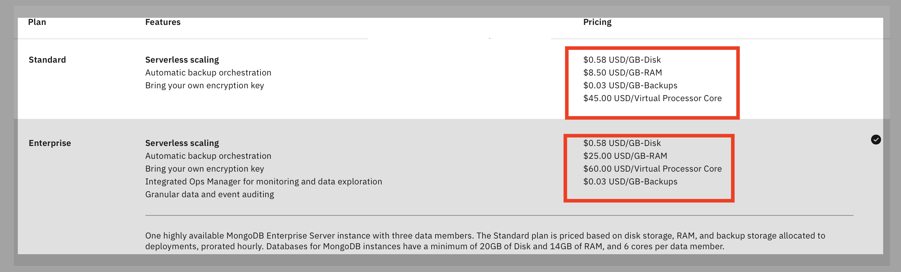
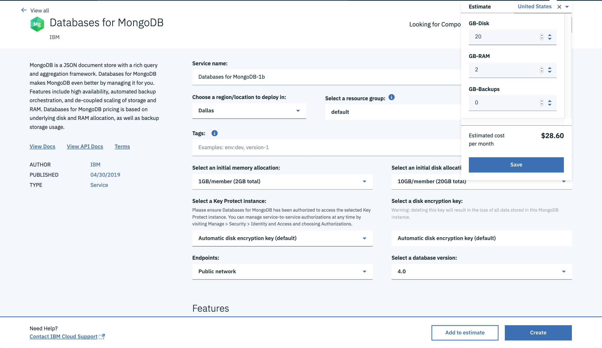

---
copyright:
  years: 2019, 2020
lastupdated: "2020-08-24"

keyowrds: mongodb, databases, pricing, scaling, resources

subcollection: databases-for-mongodb

---

{:new_window: target="_blank"}
{:shortdesc: .shortdesc}
{:screen: .screen}
{:codeblock: .codeblock}
{:pre: .pre}
{:tip: .tip}

# Pricing
{: #pricing}

An {{site.data.keyword.databases-for-mongodb_full}} Standard plan deploys as one highly available MongoDB cluster with two data members. Your data is replicated on both members.The {{site.data.keyword.databases-for-mongodb}} Enterprise plan is also deployed as one highly available MongoDB cluster but with three data members.

The Standard plan is priced based on the total amount of disk storage, RAM, and backup storage that is allocated to deployments, prorated hourly. {{site.data.keyword.databases-for-mongodb}} deployments have a minimum of 10 GB of disk and 1 GB of RAM per data member.

 The Enterprise plan pricing is based on the total amount of disk storage, RAM, and backup storage that is allocated to deployments, prorated hourly. {{site.data.keyword.databases-for-mongodb}} deployments have a minimum of 20 GB of disk, 6 cores, and 14 GB of RAM per data member.

## Cost Breakdown

**Disk storage per data member** - gigabytes of disk that are allocated to a {{site.data.keyword.databases-for-mongodb}} data member, or the size of your data.  
**RAM per data member** - gigabytes of RAM that are allocated to a {{site.data.keyword.databases-for-mongodb}} data member.  
**Backup storage** - amount of storage used for backups by a {{site.data.keyword.databases-for-mongodb}} deployment.

### {{site.data.keyword.databases-for-mongodb}} Standard Plan: 
Resources | Breakdown | Price
-------|-------|-------
10 GB-Month disk | 2 members x 10 GB x $0.58 | $11.60
1 GB-Month RAM | 2 members x 1 GB  x $8.50 | $17
{: caption="Table 1. Pricing example for two Standard data members" caption-side="top"}

Total per month = $28.60/Month  
Total per hour = $.04/Hour  

### {{site.data.keyword.databases-for-mongodb}} Enterprise Plan: 
Resources | Breakdown | Price
-------|-------|-------
20 GB-Month disk | 3 members x 20 GB x $0.58 | $34.80
14 GB-Month RAM | 3 members x 14 GB  x $25.00 | $1,050.00
6 Cores-Month | 3 members x 6 cores x $60 | $1,080.00
{: caption="Table 2. Pricing example for three Enterprise data members" caption-side="top"}

Total per month = $2,164.80/Month  
Total per hour = $2.91/Hour  
All prices here are in US dollars. To see pricing in your local currency, you can to use the pricing calculator.
{: .tip}

## Using the Pricing Calculator

For pricing estimation, use the **Add to Estimate** button at the bottom of the [{{site.data.keyword.databases-for-mongodb}} catalog page](https://cloud.ibm.com/catalog/databases-for-mongodb). Input your total consumption across two data members into the calculator. This is roughly double the size of your data because your data is replicated to both members. For example, 10 GB of disk and 1 GB of RAM across two data members would be priced at 20 GB of disk and 2 GB of RAM respectively.

## Backups Pricing

Users also receive their total disk space purchased, per database, in free backup storage. For example, in a month, if you have a {{site.data.keyword.databases-for-mongodb}} deployment that has 10 GB of disk per member, and two data members, you receive 20 GB of backup storage free for that month. If your backup storage utilization is greater than 20 GB for the month in this scenario, each gigabyte is charged at an overage $0.03/month. Most deployments will not ever go over the allotted credit.

## Dedicated Cores Pricing

You have the option of selecting the CPU allocation for your for {{site.data.keyword.databases-for-mongodb}} Standard Edition deployment, while dedicated cores are required for for {{site.data.keyword.databases-for-mongodb}} Standard Edition deployments. With dedicated cores, your resource group is given a single-tenant host with a guaranteed minimum reserve of cpu shares. Your deployments are then allocated the number of CPUs you specify. The cost of dedicated cores is $45 per core per month for the Standard plan, and $60 per core per month for the Enterprise plan. Each member gets the selected number of cores. For example, if you provision a deployment with 3 dedicated cores per member on the Standard plan, that is a total of 6 cores, and billed at $270 per month. 

The default `Shared CPU` setting provisions your for {{site.data.keyword.databases-for-mongodb}} Standard Edition deployment on hosts with shared compute resources and incurs no additional charge.

Dedicated cores are an optional feature for {{site.data.keyword.databases-for-mongodb}} Standard Edition and required for {{site.data.keyword.databases-for-mongodb}} Enterprise Edition deployments. 
{: .note}

## Scaling per Member

{{site.data.keyword.databases-for-mongodb}} deployments have minimum and maximum allocation for disk and RAM as shown. Scaling deployments through the API/CLI provides more granularity and also allows a user to scale a database instance up to 4 TB of disk per member.

### {{site.data.keyword.databases-for-mongodb}} Two-member Standard Plan:
Resource | Minimum | Maximum | Scaling Granularity (API/CLI)
----------|-----|-----|-------
Disk | 5 GB per member | 4 TB per member | 1024 MB per member
RAM | 1 GB per member | 112 GB per member | 128 MB per member
CPU (if enabled) | 3 CPUs per member | 28 CPUs per member| 1 CPU per member
{: caption="Table 2. Per Member Standard Scaling Limits" caption-side="top"}

### {{site.data.keyword.databases-for-mongodb}} Three-member Enterprise Plan:
Resource | Minimum | Maximum | Scaling Granularity (API/CLI)
----------|-----|-----|-------
Disk | 20 GB per member | 4 TB per member | 1024 MB per member
RAM | 14 GB per member | 112 GB per member | 128 MB per member
CPU | 6 CPUs per member | 28 CPUs per member| 1 CPU per member
{: caption="Table 3. Per Member Enterprise Scaling Limits" caption-side="top"}

